```mermaid
graph TD
    subgraph Ingestion
        A[Live Market Data] -->|Fetch & Clean| B(Feature Engineering)
    end

    subgraph The Hybrid Brain
        B --> C{Regime Filter}
        C -->|Low Volatility| D[Scalper Agent]
        C -->|High Volatility| E[Breaker Agent]
        D & E --> F[XGBoost Directional Alpha]
        B --> G[Autoencoder Anomaly Detector]
    end

    subgraph Execution
        F --> H{Consensus Logic}
        G -->|High Reconstruction Error| I[❌ HARD LOCK: Black Swan]
        H -->|Prediction > Threshold| J[✅ Dynamic Sizing & Execution]
    end
```

<div align="center">

# 🛡️ Sentinel: Hybrid Quantitative Trading Infrastructure

### Regime-Adaptive Institutional Execution Engine


<p align="center">
  <em>An institutional-grade algorithmic ecosystem engineered to solve the "Trilogy of Failure": Look-Ahead Bias, Overfitting, and Regime Shifts.</em>
</p>

</div>

---

## 📖 Executive Summary

**Sentinel** is a comprehensive Quantitative Research & Execution Pipeline. It employs a **Hybrid AI Architecture** that dynamically classifies market states and deploys specialized "Agent" models.

It integrates a **Forensic Data Pipeline** enforcing strict causal integrity ($T-1$), ensuring backtest signals are theoretically executable in live environments via the MetaTrader 5 bridge.

---

## 🧠 Core Architecture: The "Hybrid Brain"

The decision engine uses a **"Committee of Experts"** topology:



### 1. Ensemble Logic

* **Regime Detection:** Causal volatility filter (Short-term vs. Long-term ATR) splits market into Scalper vs. Breaker regimes.
* **Directional Alpha (XGBoost):** Specialized classifiers trained on Triple Barrier Labels (Fixed TP, SL, Time-out).
* **Anomaly Detection (Autoencoder):** Deep Neural Network (Keras) identifies out-of-distribution patterns, triggering a "No-Trade" lock.

### 2. Forensic Data Engineering ("Honest AI")

* **Anti-Leakage Protocols:** Feature engineering is strictly time-shifted (shift(1)) prior to inference.
* **Advanced Features:** Statistical Z-Scores, Volume Regimes, Price Action Derivatives.
* **Robust Normalization:** Adaptive scaling fitted only on training folds to prevent distribution drift.

### 3. Live Execution Engine (MT5 Bridge)

* **Real-Time Sync:** Threaded loop syncing candle closures to milliseconds.
* **Dynamic Risk:** Position sizing based on Account Equity % and Volatility-Adjusted Stop Loss.
* **Self-Healing:** Handles API timeouts and connection drops autonomously.

---

## 🛠️ Technical Stack

| Component    | Technology       | Description                                      |
| ------------ | ---------------- | ------------------------------------------------ |
| Core Logic   | Python 3.10+     | Asynchronous Event Loop & Orchestration          |
| Alpha Model  | XGBoost          | Gradient Boosting for Directional Classification |
| Safety Model | TensorFlow/Keras | Autoencoder for Out-of-Distribution Detection    |
| Data Ops     | Pandas / NumPy   | High-performance Vectorization                   |
| Broker API   | MetaTrader 5     | Direct DMA/STP Execution Bridge                  |
| Optimization | Numba            | JIT Compilation for Backtesting Loops            |

---

## 🧬 Forensic Data Pipeline (ETL)

Custom ETL engine (`data_engineering.py`) for institutional data:

* **Gap Filling:** Forward-fill logic repairs missing M1 candles.
* **Resampling Engine:** Converts M1 to M3/M10 timeframes with precise aggregation.
* **Latency Handling:** Aligns candle closures with broker server to prevent Look-Ahead Bias.

---

## 📂 Project Structure

```bash
Algorithmic-Trading-Infrastructure/
├── data_engineering.py     # ETL & Forensic Cleaning
├── trainer.py              # Model Training (XGBoost + Autoencoder)
├── backtester.py           # Event-Driven Validation Engine
├── master.py               # Live Execution Bridge (MT5)
└── README.md               # Documentation
```

---

## 🚀 Workflow: Research to Production

1. **Forensic Ingestion:** Clean and resample raw tick data.
2. **The Trainer:**

   * Generates "Honest" Triple Barrier Labels.
   * Trains Autoencoder on "Safe" market manifolds.
   * Trains XGBoost Agents on latent features.
3. **The Backtester:** Runs event-driven simulations on Out-of-Sample data with spread/slippage modeling.
4. **The Master:** Deploys the ensemble to Live Trading.

---

## ⚠️ The "Reality Check" Philosophy

99% of trading bots fail due to Data Leakage. Sentinel assumes the market is adversarial:

* Autoencoder rejects anomalous data.
* Strict causal feature engineering prioritizes robustness over hypothetical hyper-optimized returns.

<div align="center">
  Disclaimer: This software is for educational and research purposes only. Algorithmic trading involves significant financial risk.
</div>

Engineered by Redouane Boundra.
